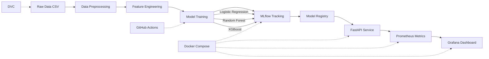
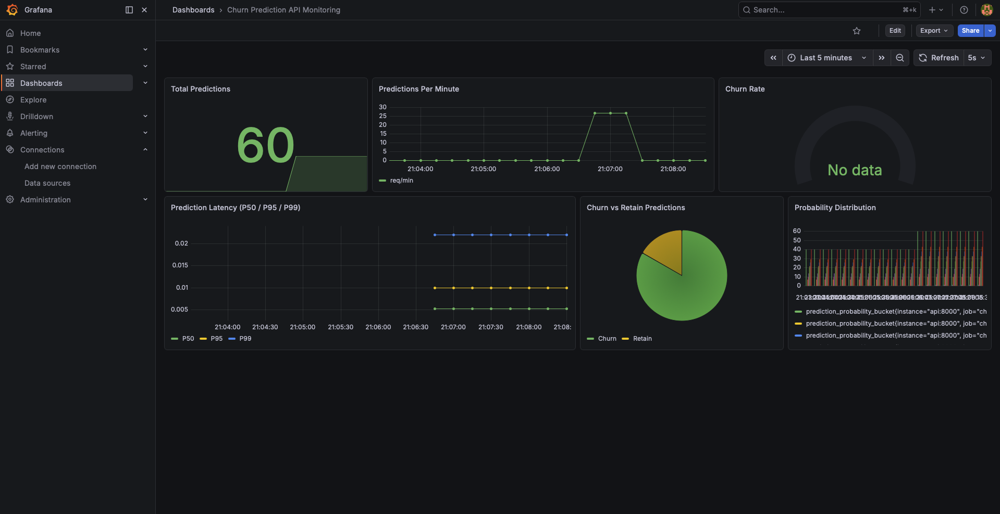

# Customer Churn MLOps Pipeline

End-to-end MLOps pipeline for customer churn prediction with experiment tracking, model registry, API serving, and real-time monitoring.


## Architecture



## Model Performance

| Model | AUC-ROC | F1 | Recall | Precision |
|-------|---------|-----|--------|-----------|
| Logistic Regression | **0.8372** | 0.6095 | 0.7888 | 0.4966 |
| XGBoost | 0.8355 | 0.6075 | 0.7781 | 0.4983 |
| Random Forest | 0.8344 | 0.6289 | 0.7273 | 0.5540 |

### Threshold Analysis (Business Cost Optimization)

| Threshold | Recall | Missed Churners | Business Cost | Revenue Saved |
|-----------|--------|-----------------|---------------|---------------|
| 0.30 | 91.98% | 30 | $38,100 | $154,800 |
| 0.50 | 78.88% | 79 | $54,450 | $132,750 |
| 0.60 | 71.93% | 105 | $63,400 | $121,050 |

Optimal threshold: **0.30** (lowest business cost, catches 92% of churners)

## Monitoring Dashboard



## Quick Start

```bash
# Clone
git clone https://github.com/Thejas2003gowda/churn-mlops.git
cd churn-mlops

# Start all services (API + MLflow + Prometheus + Grafana)
docker compose up --build
```

Services available at:
- API: http://localhost:8000/docs
- MLflow: http://localhost:5001
- Prometheus: http://localhost:9090
- Grafana: http://localhost:3000 (admin/admin)

## API Usage

```bash
# Health check
curl http://localhost:8000/health

# Single prediction
curl -X POST http://localhost:8000/predict \
  -H "Content-Type: application/json" \
  -d '{
    "gender": 1, "SeniorCitizen": 0, "Partner": 0, "Dependents": 0,
    "tenure": 2, "PhoneService": 1, "MultipleLines": 0,
    "OnlineSecurity": 0, "OnlineBackup": 0, "DeviceProtection": 0,
    "TechSupport": 0, "StreamingTV": 0, "StreamingMovies": 0,
    "PaperlessBilling": 1, "MonthlyCharges": 70.5, "TotalCharges": 141.0,
    "InternetService_Fiber optic": 1, "InternetService_No": 0,
    "Contract_One year": 0, "Contract_Two year": 0,
    "PaymentMethod_Credit card (automatic)": 0,
    "PaymentMethod_Electronic check": 1,
    "PaymentMethod_Mailed check": 0
  }'

# Prometheus metrics
curl http://localhost:8000/metrics
```

## Project Structure
churn-mlops/
├── src/
│   ├── data_preprocessing.py    # Clean, encode, handle missing values
│   ├── feature_engineering.py   # Domain-specific feature creation
│   ├── train.py                 # Training pipeline with MLflow logging
│   └── evaluate.py              # Threshold analysis + business cost
├── api/
│   ├── main.py                  # FastAPI with Prometheus metrics
│   └── schemas.py               # Pydantic input/output validation
├── tests/                       # Unit tests (6/6 passing)
├── monitoring/
│   ├── prometheus.yml           # Scrape config
│   └── grafana/                 # Dashboard JSON + provisioning
├── models/                      # Trained model artifacts
├── data/                        # Raw + processed (DVC tracked)
├── docker-compose.yml           # 4-service stack
├── Dockerfile
├── dvc.yaml
└── .github/workflows/ci.yml    # CI: lint + test + model validation

## Tech Stack

| Component | Technology |
|-----------|-----------|
| ML Framework | scikit-learn, XGBoost |
| Data Versioning | DVC |
| Experiment Tracking | MLflow |
| Model Serving | FastAPI |
| Monitoring | Prometheus + Grafana |
| Containerization | Docker + Compose |
| CI/CD | GitHub Actions |
| Testing | pytest + ruff |

## Features Engineered

- **tenure_group**: Customer lifecycle bucketing (0-12, 13-24, 25-48, 49-60, 60+ months)
- **avg_monthly_charges**: Spending velocity (TotalCharges / tenure)
- **has_premium_support**: OnlineSecurity OR TechSupport active
- **service_count**: Total active services per customer
- **is_new_customer**: Tenure < 6 months flag
- **charge_per_service**: Monthly cost efficiency metric
- **is_high_spender**: Above-median monthly charges

## Dataset

IBM Telco Customer Churn — 7,043 customers, 21 features, 26.6% churn rate.

## License

MIT
